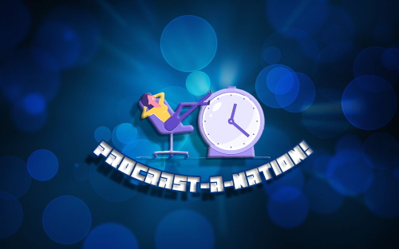
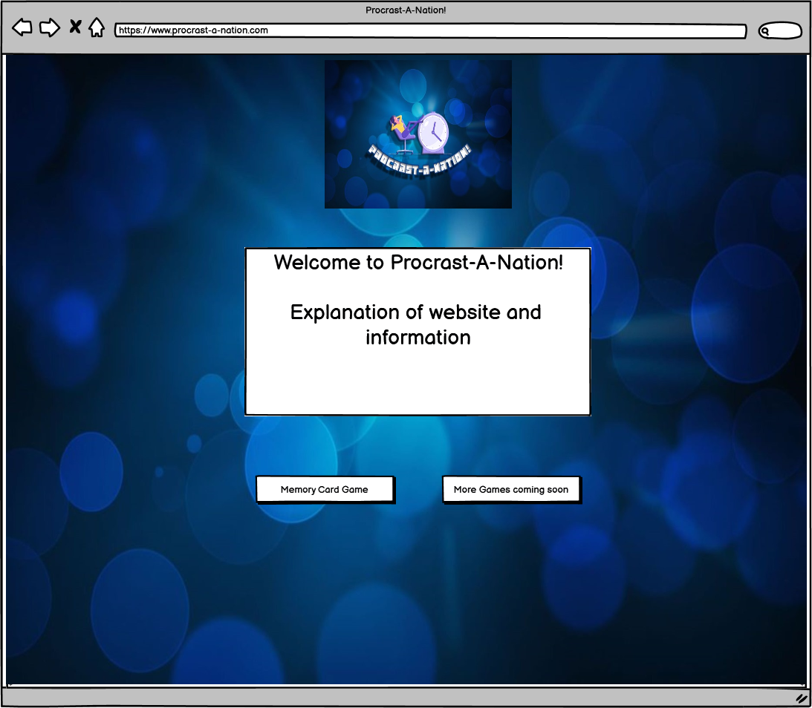
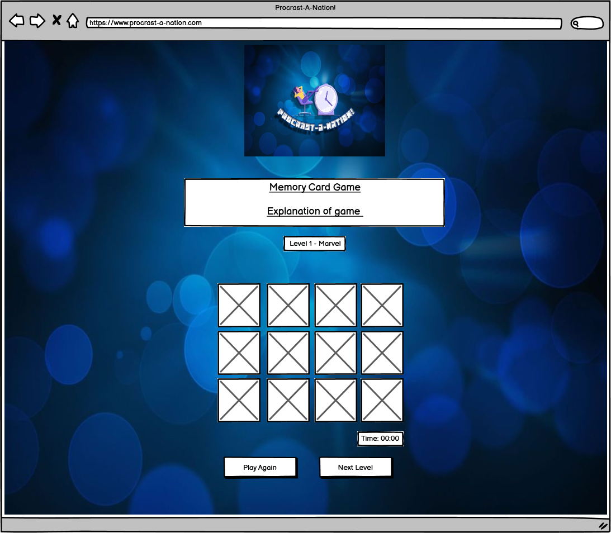
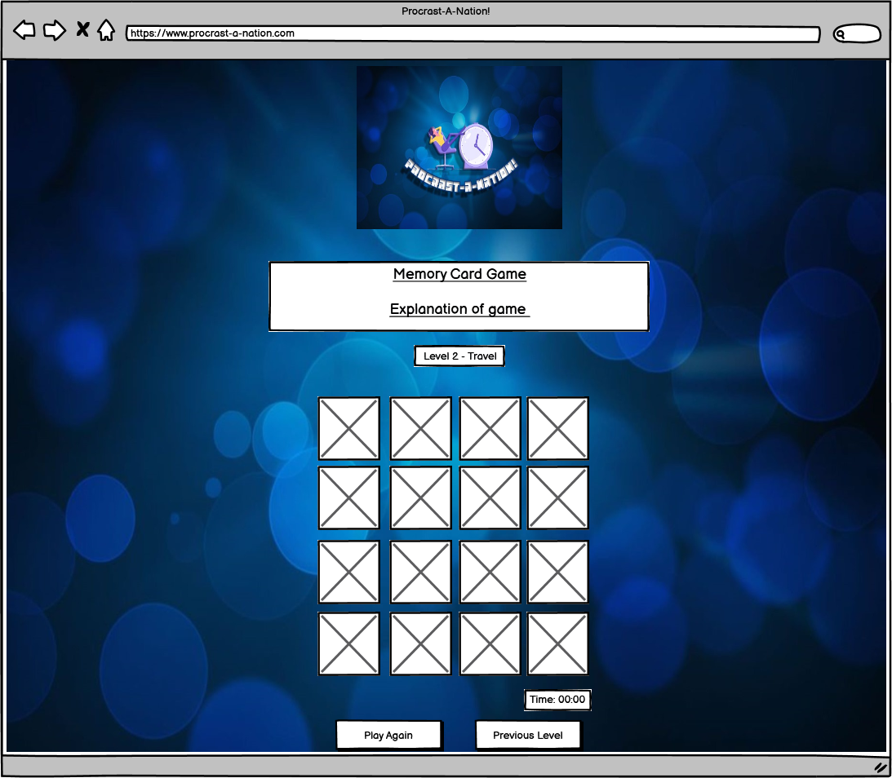
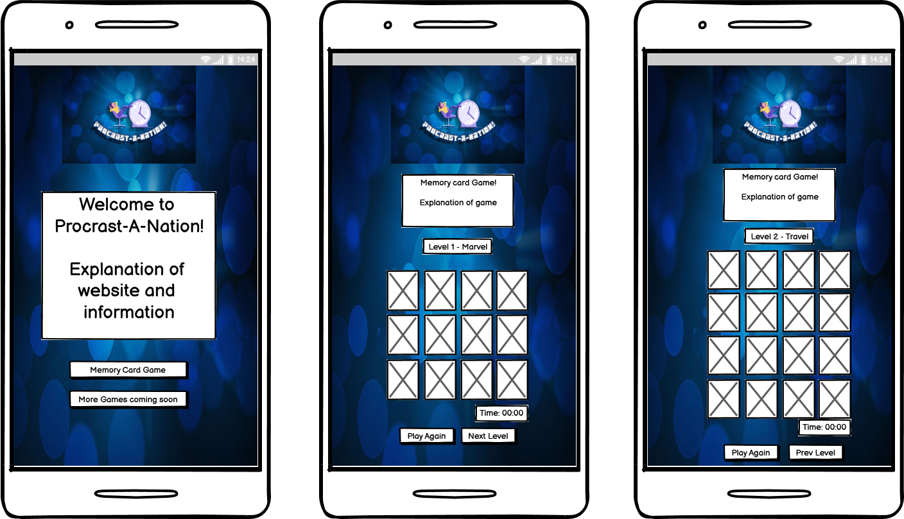

<h1 align="center"></h1>

[View the live website here.](https://passion4film.github.io/Milestone-Project-2/)

# Procrast-A-Nation!
I wanted to create a game website to provide some amusement and distraction for people who suffer from stress and bordom in their busy lives. I beleive it is sometimes easier to focus on the important work/studies if you acknowledge that some fun is necessary and create time and space to indulge in a bit of procrastination.
All human beings can procratinate, therefore I decided to call my website a play on that word and the nation: Procrast-A-Nation.

## User stories

- #### Site user goals
    1. As site user, I want 
    2. As site user, I want 
    3. 

- #### Site owner goals
    1. As a site owner, I want 
    2. As a site owner, I want 
    3. 

-   ### Design
    -   #### Colour Scheme
        -   The main colours used are blue and white, as these complement each other nicely. I also feel that blue is a calm and relaxed colour and thats the feel I want to encourage in the website; that this is a place to chill and not worry about time or work. I used a background image with a pattern as I feel that is more interesting than a plain coloured background. However, I chose a pattern that isnt 'busy' so as not to be distractng to the eye when playing the games.
    -   #### Typography
        -   The Roberto Condensed font is used throughout the whole website with Sans Serif as the fallback font in case for any reason the font isn't being imported into the site correctly. Roberto Condensed is easy to read, attractive and appropriate to the asthetic of the site. The font colour throughout is white to make it stand-out and for ease of reading against the background.
    -   #### Imagery
        -   I created the site logo using Adobe Photoshop and a stockphoto located online that I edited to suit my purpose. The images for the cards had to fit each theme, Marvel Characters for level 1 and travel pictures for level 2. The images had to be re-sized to be uniform and fit in the game-grid, they also had to be clear and of good quality so that the users were able to match them properly. 

## Wireframes page designs:
Home page wireframe:



Memory Card Level 1 page wireframe:



Memory Card Level 2 page wireframe:



The pages as shown on a mobile wireframes:



## Features

-   Responsive on all device sizes.

-   Interactive memory card game, with more than 1 level.

-   Home-page: This page is the landing page when you visit the site, so it needed to be clear about what the website was about. There are clear option buttons which allows the user to navigate the site easily.

-   Memory Card Level 1: 

-   Memory Card Level 1: 

### Future Features
-   I would like to create and add more games using vanilla JavaScript, which is why I left a 'more games coming soon button' to let the users know that if they liked this site to keep coming back to see what new games will be added in the future. I did follow a online tutorial to create a 'Snake' game using JavaScript, however I didn't think it was necessary to add that to this website currently as I am not advanced enough yet to develop the basic game idea further and customize it. But in the future games like 'Snake' and 'Naughts & Crosses' could be added to the games inventory for this site.

## Technologies Used

### Languages Used

-   In this project I used [HTML5](https://en.wikipedia.org/wiki/HTML5), [CSS3](https://en.wikipedia.org/wiki/Cascading_Style_Sheets) and [JavaScript](https://en.wikipedia.org/wiki/JavaScript). 

### Frameworks, Libraries & Programs Used

-   I also made use of the [Bootstrap framework library](https://getbootstrap.com/).
-   [Google Fonts:](https://fonts.google.com/) Google fonts were used to import the 'Roberto Condensed' font into the style.css file which is used on all pages throughout the project.
-   [Font Awesome:](https://fontawesome.com/) Font Awesome was used on all pages throughout the website to add icons for aesthetic and UX purposes.
-   [GitHub:](https://github.com/) GitHub is used to store the projects code after being pushed from Git.
-   [Git:](https://git-scm.com/) Git was used for version control by utilizing the Gitpod terminal to commit to Git and Push to GitHub.
-   [Responsinator:](http://www.responsinator.com/) Responsinator was used to check the site was responsive across all devices.
-   [Balsamiq:](https://balsamiq.com/) Balsamiq was used to create the wireframes during the design process.
-   Chrome browser & Microsoft Edge.
-   Adobe Photoshop, for the logo.


## Testing

The W3C Markup Validator and W3C CSS Validator Services were used to validate every page of the project to ensure there were no syntax errors in the project.


### Testing User Stories from User Experience (UX) Section

- #### Site user goals
    1. As site user, I want 
        -   Upon entering the site 
    2. As a site user, I want 
        -   The 
    3. 

- #### Site owner goals
    1. As a site owner, I want 
        -   The 
    2. As a site owner, I want 
        -   The 
    3.  

### Further Testing

-   The Website was tested on Google Chrome, Microsoft Edge and FireFox browsers to check it loaded correctly.
-   The website was viewed on a variety of devices such as Desktop, Laptop, iPhone7 Plus & Android phones to check it loaded correctly.
-   The website was tested on Responsinator to ensure responsiveness on all devices.
-   A large amount of testing was done to ensure that all pages were linking correctly. This was done by frequently moving from one page by clicking the button links for all pages on all devices.
-   
-   Friends and family members were asked to review the site and documentation to point out any bugs and/or user experience issues, they reported a success on all fronts.

## Known Bugs

No bugs have been located at the time of Deployment.

## Deployment

### GitHub Pages

The project was deployed to GitHub Pages using the following steps...

1. Log in to GitHub and locate the [GitHub Repository](https://github.com/Passion4film/Milestone-Project-1/)
2. At the top of the Repository (not top of page), locate the "Settings" Button on the menu.
    - Alternatively Click [Here](https://raw.githubusercontent.com/) for a GIF demonstrating the process starting from Step 2.
3. Scroll down the Settings page until you locate the "GitHub Pages" Section.
4. Under "Source", click the dropdown called "None" and select "Master Branch".
5. The page will automatically refresh.
6. Scroll back down through the page to locate the now published site [link](https://github.com/Passion4film/Milestone-Project-1) in the "GitHub Pages" section.

### Forking the GitHub Repository

By forking the GitHub Repository we make a copy of the original repository on our GitHub account to view and/or make changes without affecting the original repository by using the following steps...

1. Log in to GitHub and locate the [GitHub Repository](https://github.com/Passion4film/Milestone-Project-1)
2. At the top of the Repository (not top of page) just above the "Settings" Button on the menu, locate the "Fork" Button.
3. You should now have a copy of the original repository in your GitHub account.

### Making a Local Clone

1. Log in to GitHub and locate the [GitHub Repository](https://github.com/Passion4film/Milestone-Project-1)
2. Under the repository name, click "Clone or download".
3. To clone the repository using HTTPS, under "Clone with HTTPS", copy the link.
4. Open Git Bash
5. Change the current working directory to the location where you want the cloned directory to be made.
6. Type `git clone`, and then paste the URL you copied in Step 3.

```
$ git clone https://github.com/Passion4film/Milestone-Project-1
```

7. Press Enter. Your local clone will be created.

```
$ git clone https://github.com/Passion4film/Milestone-Project-1
> Cloning into `CI-Clone`...
> remote: Counting objects: 10, done.
> remote: Compressing objects: 100% (8/8), done.
> remove: Total 10 (delta 1), reused 10 (delta 1)
> Unpacking objects: 100% (10/10), done.
```

Click [Here](https://help.github.com/en/github/creating-cloning-and-archiving-repositories/cloning-a-repository#cloning-a-repository-to-github-desktop) to retrieve pictures for some of the buttons and more detailed explanations of the above process.

## Future maintainability

The images used are stored in the assests/images folder for easy maintainability, the memory card game images are also divided into their own separate folder so it is clear which image relates to what. It will be simple to swap out or update pictures and the image locations in the HTML are clear.

There is clear code commenting for each section of the HTML pages, which make it easy for developers to view for future maintenence. It makes changing the code/updating the details easier for other developers.

There is also clear code commenting in the CSS & JavaScript sections. Each section is clearly labled to ensure if any bugs or errors do occur it will be simple to see what part of the page each CSS and JavaScript section affects. This makes updating and changing the CSS and JS effects easier for other developers.

## Credits

### Content

Online tutorials:

[Bootstrap](https://getbootstrap.com/docs/4.4/getting-started/introduction/): Bootstrap Library used during the project.

### Media

I created the logo for the site using Adobe Photoshop.

The images for the background and Memory card game used in this site were obtained from Google/images. 

[Background image](https://www.wallpaperup.com/2240/Abstract_blue_circles.html)

Memory Card Level 1
    -   [Marvel Logo](https://wallpapersafari.com/w/AWyX8S)
    -   [Captain America](https://i.pinimg.com/736x/53/73/1e/53731ede3bea7cc3987d0268dedff515--captain-america-comic-capt-america.jpg)
    -   [Wolverine](https://wallpapersafari.com/w/m4IO3L)
    -   [Spiderman](https://www.pinterest.co.uk/pin/261701428325628475/)
    -   [Thor](https://www.wallpapertip.com/wpic/ihoTwo_marvel-comics-wallpapers-iphone-hd/)
    -   [Ironman](https://www.pinterest.co.uk/pin/393924298629357197/)
    -   [Hulk](https://br.pinterest.com/pin/444097213247148553/)

Memory Card Level 2
    -   [Planes background](https://static8.depositphotos.com/1353632/1053/v/950/depositphotos_10536679-stock-illustration-planes-background.jpg)
    -   [Pyramids](https://www.pinterest.co.uk/pin/774124907307794/)
    -   [Petra](https://www.hunebednieuwscafe.nl/2018/09/petra-jordan/)
    -   [Chichen Itza](https://assets-global.website-files.com/56e9debf633486e330198479/57ebf0414c12cc233cbdbed0_under30experiences-blog-7-reasons-you-have-to-see-tulum-chichen-itza.jpeg)
    -   [Great Wall of China](https://www.google.co.uk/url?sa=i&url=https%3A%2F%2Fwww.art.com%2Fgallery%2Fid--b6960%2Fgreat-wall-of-china-posters.htm&psig=AOvVaw0s0qYAYBFsq5Z_maunCg6Q&ust=1611754086271000&source=images&cd=vfe&ved=0CAIQjRxqFwoTCNjm1drbue4CFQAAAAAdAAAAABAD)
    -   [Taj Mahal](https://www.loweaston.co.uk/uploads/images/Gallery/World-Destinations-Portrait/World_32.jpg)
    -   [Colosseum](https://ohfact.com/wp-content/uploads/2015/07/The-Roman-Colosseum.jpg)
    -   [Christ the Redeemer](https://upload.wikimedia.org/wikipedia/commons/thumb/e/e7/Aerial_view_of_the_Statue_of_Christ_the_Redeemer.jpg/220px-Aerial_view_of_the_Statue_of_Christ_the_Redeemer.jpg)
    -   [Machu Picchu](https://www.pinterest.ch/pin/431923420486291443/)

All photos used are stored in the assets folder (and in their own named folders) and labled clearly.

## Acknowledgements

I received inspiration for this project from the online tutorials and example websites credited above as well as help from my Mentor; Antonio Rodriguez.

**DISCLAIMER: This project is for educational purposes only, no materials/files are intended for any commercial use**
