# Manual Testing Evidence

**please note that, as credited in the README, this code was taken from watching the video tutorial by Youtube user [freeCodeCamp.org](https://www.youtube.com/watch?v=ZniVgo8U7ek&t=330s). However during the middle of the project mentor session, we refractored and simplified alot of the JavaScript code from this video so it doesnt match this exactly anymore, but the basic game did grow from this source.

* Testing the event listener:

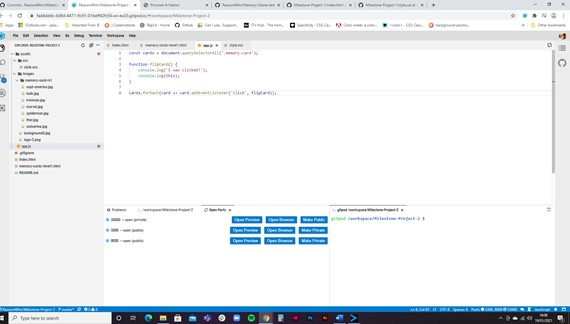
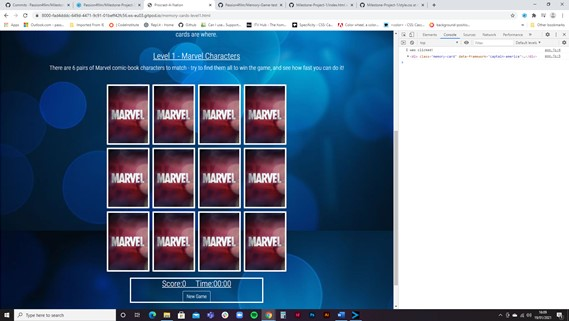

* Testing the flipcard:

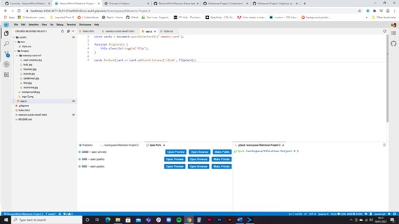
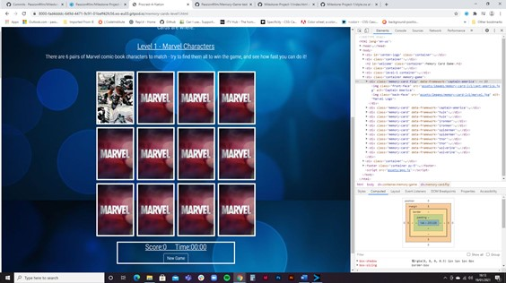

* Testing console.log for storing the cards:

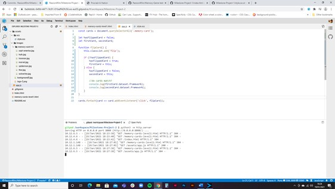
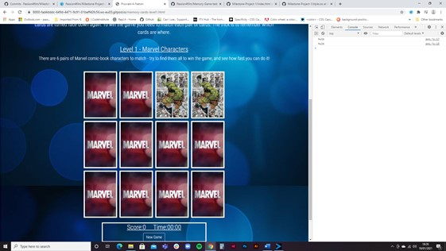

* Testing whether the cards match:

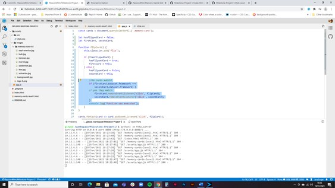
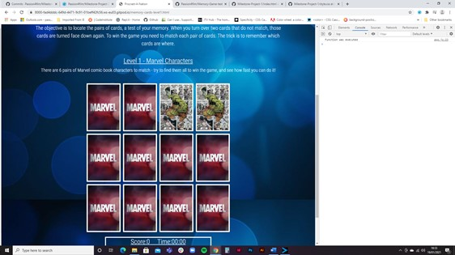

* Had to add a set-timeout as the function to flip the cards if they didn’t match executed too quickly.

* Bug - at this point if we try to flip a second set of cards before the first have finished 'unflipping', then it crashes the logic and they get left turned over but not matching:

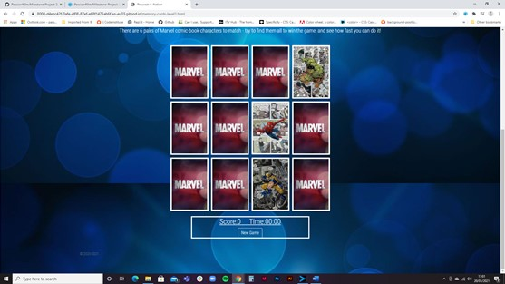

* So we need to lock the board to allow the cards to finish the unflipping function:

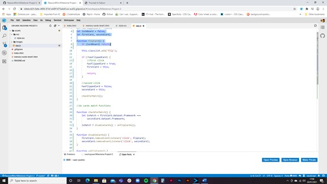

* Bug - if you click twice on same card it counts as second click and disables the unflip function – so the card remains flipped:

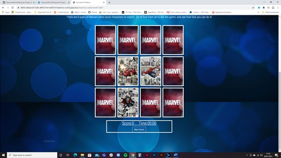

* So we needed to re-set the board:

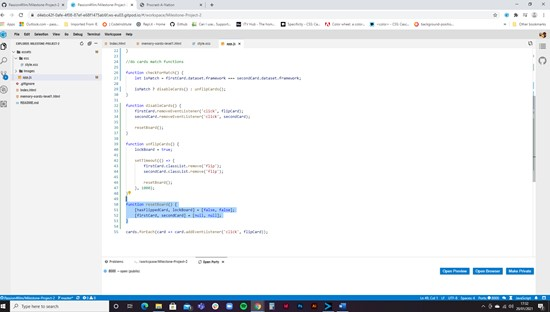

* We needed to shuffle the cards – the function was wrapped inside a parenthis which means function will be immediately invoked right after it’s definition:

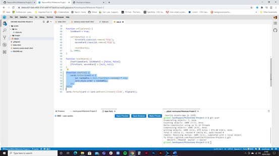
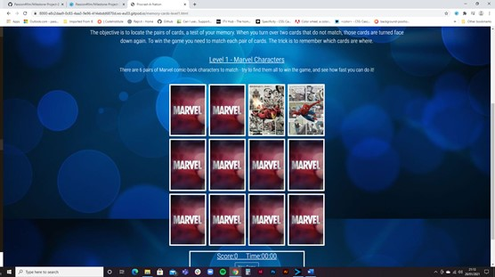

* Setting a timer function to start once the first card is clicked. Taken from video created by Youtube user [codeTonight](https://www.youtube.com/watch?v=QrTCHHhoUQU):

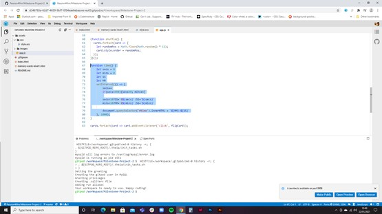
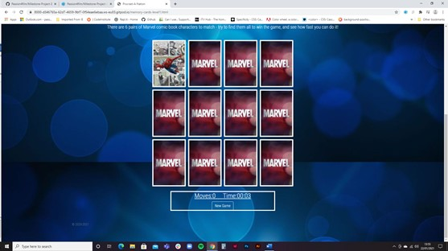

* Added a section of JS code that counts the amount of moves made:

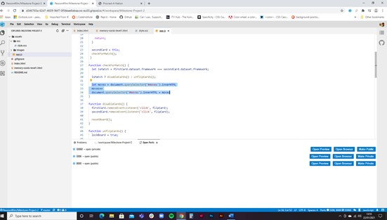
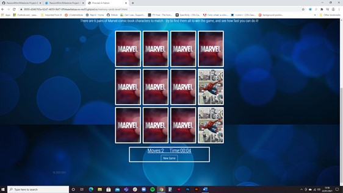

# Bugs and issues that needed to be overcome:

## Matching the cards

* Expected

    - The game is expected to know when 2 cards match each other and to keep them turned face-up, if they do not match they are to be flipped back over for the user to try again. Used frameworks to name each card image and created code that checked the framework names to know if the cards matched or not.

* Testing

    - Tested the site by running the matchcard funtion multiple times and running a check in the console.log to ensure it was registering whether 2 cards matched or not. 

* Result

    - Cards that match remain face-up and cards that dont match are 'unflipped' so their image is hidden again and then the user can try again.

## Game timer function

* Expected

    - The game timer function triggering with the first click of the first card of the game only, and not every time a card was clicked.

* Testing

    - Tested the site by playing the game and watching the time to see what happened.

* Result

    - The time function was triggering with each first click on a card.

* Fix

    - Overcame with 'var firstClick = false' in app.js, which solved the problem and now the timer function only activates on the first card click at the beginning of the game.

## Disable cards

* Expected

    - Once two cards had been over-turned and no match found, they needed to be 'unflipped' again so the user couldnt keep 'flipping' the cards before the match function could be executed.

* Testing

    - Tested the site by quickly clicking on multiple cards when the game started and triggering them to be 'flipped'.

* Result

    - Without time to execute the match function the cards remained flipped over and therefore broke the game.

* Fix

    - A disableCards funtion was needed, which locked the board until the match function had resolved. Also needed to create a 'disableAllCards' funtion for when the game is won or lost so the user cant keep playing so they need to select to play again or a new level.

## Level 2 problems

* Expected

    - Once the code was in place for the first level, I aimed to incororate the same code for a second, harder, level. The code was expected to work the same way.

* Testing

    - Tested the site when the level 2.html was created and the new game grid/images uploaded.

* Result

    - The code didnt work and no cards were flipped and the time and score didnt update. Also as there were 8 pairs of cards instead of 6 the critera for winning the game was wrong.

* Fix

    - The 'const cards' variable wasnt triggering for the level 2 cards, to overcome this a 'cards2' was created and another event listener. 
        A level1 & level2 ID was given to each game grid and these targeted using 'getAttribute('id')' and 'levelOneMatches' and 'levelTwoMatches' variables created.

## IOS Mobile devices

* Expected

    - The site is expected to work on a mobile device exactly the same way as a desktop.

* Testing

    - Tested the site using Chome Dev Tools for responsivness and sent the deployed link to several mobile devices, some android and some iPhones of differing types.

* Result

    - The CSS wasnt loading correctly for the game on IOS software, the cards wouldnt 'flip' correctly.

* Fix

    - Solved this by running the appropriate CSS through 'Autoprefixer' (as linked to in README) and adding the webkit options to the code for IOS software.

[Return to README](README.md)